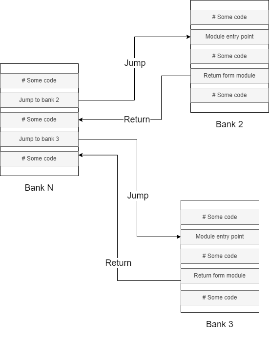

Universal Modular Platform based on Cdm-8 processor

Platform Description

# Overview
In our project we decided to build a universal platform that can be used for different purposes.

# Hardware 
In this section we will describe hardware part of this platorm.

## Basic setup
The bare minimum for this platform is cdm8 cpu, address decoder rom and ram


## IO Bus

To communicate with devices we need to define what IO bus looks like.


Bus lines:

* `Data` - processor data bus
* IO Address - lower 4 bits of processor address bus, generated by `Address decoder`
* IO Select - generated by `Address decoder`
* Read/Write - processor r/w' signal
* Clock - system clock signal

## Expanding ROM

If we need more program memory we can use ROM controller to get more address space with memmory paging technique. 

We take `Address Out` signal of `ROM Controller` and connect it as higher bits of ROM's address input.


*scheme here*

*image here*

### Mb interrupts here

## Expanding RAM

If we need more RAM we can use similar technique.The difference is that we divide RAM address space into two halfs - lower half is global and upper half is paged.

`RAM Controller` forms expanded address for RAM chip.

*scheme here*

*image here*

## Handling Interrupts

#### Without ROM Controller

In Cdm8 in harvard setup interrupt vectors are located in in upper 16 bytes of program memory and therefore theese vectors are constant.

In out platform you can use it as is or connect Dynamic Interrupt Controller which allows you to change theese vectors by masking their addresses with external registers. 

But this device is unconpatable with ROM controller

#### With ROM Controller

ROM Controller takes part in interrupt handling process - when interrupt occurs controller changes memory page to one that is specified on corresponding controller pins.

The easiest way to specify page to handle interrupts is to connect a constant to theese pins, however in this case you cannot change it.

Better solution is to connect a register to bus and it's output to ISR Page pins. In that case you can set page dyncamically in runtime.

## Devices description

In this block we will describe each device more precisely.

### Peripheral Example

Most of devices connect to IO bus and therefore have similar block and signals that are used to communicate with the bus. 

*images with descripiton*

+ `Select` - high when someone 'talks' to device, IO selected and IO address is the same as device address. 

> Of course, address decoding typically implemented through `AND` gates, but there we decided to replace it with `logisim`'s comparator to have an ability to conviniently set the address of devices. (perf)


+ `General bus signals` - pins for correspondig bus signals


+ `Device data bus` - pins that connect to data bus. Signals `Write` and `Read` are also generated here. They show whether we writing to this device or reading from it.


Typically, devices have general singals on their's north side and data bus pins on west side.


### Utility Devices

The some utility devices.


+ Front Detectors - two types of regular front detectors with shorter and longer pulse time.
+ 8-OR - Fancy 8 input OR gate.

### ROM Controller

This contoller is used to work with memory banks. It handles bank switching.  Moreover it takes part in interrupt handling, when interrupt occurs, controller switches bank to one that specified on `ISR Bank` input.

When jumping to bank, it saves current bank, it gives ability to jump to bank and then return from it just like regular `jsr` and `rts`. Moreover it supports recursive calls.



+ Programmer can switch between banks by writing a number N in range 0x00-0x7F. Then controller will switch to bank N.

+ By writing 0x80 or 0x81 we can reutrn from bank.

+ 0x80 is used to return from bank in general. 

+ 0x81 is used to ruturn from bank and restore registes.

+ If we read from it we get current bank.

To perform a jump you need to specify bank and address in this bank to jump to.

In this example we jump to bank 2 address 0x00:
```c

ldi r0, 0xF0 # Let controller be on address 0xF0
ldi r1, 0x02 # Jump to bank 2
st r0, r1    # Write command to controller
jsr 0x00     # Jump some address in target block

```

In this example we return from bank:
```c

ldi r0, 0xF0 # Let controller be on address 0xF0
ldi r1, 0x80 # "Return" command
st r0, r1    # Write command to controller
rts          # Return from function

```

In this example we return from ISR and restore registers:
```c

# Begining of ISR

pushall      # Save registers

# Some code...

ldi r0, 0xF0 # Let controller be on address 0xF0
ldi r1, 0x81 # "Return and restore" command
st r0, r1    # Write command to controller
popall       # Restore registers
rti          # Return from ISR

```

(It switches banks by forming high part of address.)


`S1` - memory chip that together with counter `C1` forms stack, so we can perform push and pop.

`R1` - intermediate register that stores byte (command) that was written.

The heart of this device is `Sequencer`. It is used to execute commands. `C2` is a counter that outputs current phase, its output is connected to decoder to convert binary number to separate signal representing phases. `D3` - trigger that enables counter. 

`Delay chain` is another important block of this device. It delays the pulse that starts `Sequencer` by certain amount of clock cycles. 

`D1` - trigger that indicates that device is handling interrupt.

`D2` - trigger that indicates that device is executing some commnd, its /Q output is connected to `IR Enable` output to disable interrupts while we performing a jump.

*How it works....*

**Executing a command (jump to bank, return):**

+ When processor writes a command: command is present in `R1`, `Write_Clock` is high, `rti`, `pop`, `push` signals are decoded.

+ `Write_Clock` sets `D2` high and so disables interrupts

+ `Write_Clock` starts a `Delay chain`, a pulse travels through `Delay chain` and then sets `D3` high and so enables `Sequencer`.

+ `Sequencer` execute some commands depending on 
task and then resets and disables itself and enables interrupts.

**Handling an interrupt:**

+ When processor starts handling an interrupt, `IAck` goes high.

+ `IAck` sets `D3` high enabling sequencer and sets `D1` high. 

+ `IR` switches `S1` data bus to `ISR Bank` input, setting target bank to bank with ISR's.

+ Then, regular 'jump to bank N' command is executed.

**Commands:**

*'jump to bank N':* 

Command will look like number in range `0x00`-`0x7F`, so general view is `0b0nnnnnnn`, where `nnnnnnn` is target bank number in binary

+ `rti` is low, `pop` is low, `push` is high
+ `inc` - increnent `C1` 
+ `store` - write `R1` to `S1` at address in `C1`
+ Then, `0b0nnnnnnn` is present on `Address Out` and theese are higher bits of ROM address

*'return from bank':*

Command is `0x80` or `0b10000000`. 

+ `rti` is low, `pop` is high, `push` is low
+ `dec` - decrement `C1`
+ Then, previous bank number is present on `Address Out`

*'return from bank and restore registers':*

Command is `0x81` or `0b10000001`.

+ The same as in regular 'return from bank', but `rti` is high.
+ `rti` switches multiplexer and sequencer start a couple of clock cycles later. That gives processor time to perform `popall` instuction.

All timings in clock-perfect amd were calculated for cdm8 mark 5.

*maybe timing diagram*

### RAM Controller

### Interrupt Arbiter

### Interrupt Enable Buffer

### Address Decoder

### Dynamic Interrupt Controller

### IO Register

### IO Hex Display Controller

### IO Seven Segment Display Controller

### IO Hardware Stack ?

### IO Random Number Generator

### Display Controller


### Joystick Controller

This controller drives 4-bit joystick.


Additional pins:

+ X,Y (west) - pins to X and Y outputs of joystick


It just connects 4-bit X and Y pins to data bus.

When reading from it you get actual position of joystick.

### Keypad Controller

This controller can drive up to 8 buttons. It can be used in polling mode or through interrupts.


Additional pins:

+ IRQ (north) - interrupt request line for this device, active when some buttons are pressed
+ Button pins (south) - 8 pins for buttons


It has 8 D-triggers each connected to a bit in a data bus. Buttons asynchronously set corresponding triggers. Triggers are reset on falling edge of `Read` signal (which is `rd/wr' AND Select`).

So, when reading from it, processor gets a byte that contains information about buttons that were pressed in the past (If some bit is 1, then corresponding button was pressed). After reading, all triggers are reset.

Moreover, if all triggers were zero and some button is pressed then a pulse occurs at IRQ output triggering interrupt.

### Terminal Controller

This controller is used to drive terminal and keyboard.


Additional pins:

+ Terminal/Keyboard pins (south) - pins that connect to terminal and keyboard


This controller basically just connects terminal and keyboard to bus in a way that when writing, 7 bits of data (as ASCII symbol) goes to the terminal and `last bit of data AND Write` forms `Terminal Clear` signal. That means that we can write a character to terminal as well as clear it by sending `0x80`.

When reading keyboard buffer connects to 7 bits of data bus and `Keybaord Available` goes to the last bit of data bus. That helps to read out a whole buffer. Just read from this device while data is not equal to `0x80`.

This device supports interrupts. If keybaord buffer was empty and then there was some input, a pulse occurs on IRQ.

# Software

In this part we will describe software part of this platform.

As we use more than 256 bytes of program memory and need to work with a lot of code default development tool (CocoIDE) is very unconfotable to use and that's why we developed some tools to make software development process easier.

## cocomake

The main application that does hard work is cocomake. It is an incremental build system desined to work with multifile projects. 

It is incremental, so only modified files get recompiled. That makes compiling much faster.

There, one bank(module) is one translation unit.
Each file is compiled to an 256 byte image and then theese 256 byte images glued together to produce one big image that you load straight in logisim.


So, you can have one big project with a lot of files spannig to many modyles and you just execute one command and get your project compiled in one image.

## VS Code Integration

For the text editor we decied to use VS Code as it is free modern software with a lot of custimization options via extensions.

To make support for cdm8 assembler we develpoed an extension to VS Code that adds syntax highlighting for assembly and c preprocessor directives as well as code snippets.

# Demonstration

In this section we will describe out demonstation setup. 

## Scheme Overview

*image*

We use this this this

## Code Overview

We set up cocomake like this
...

*code samples*

# Conclusion

idk