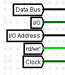
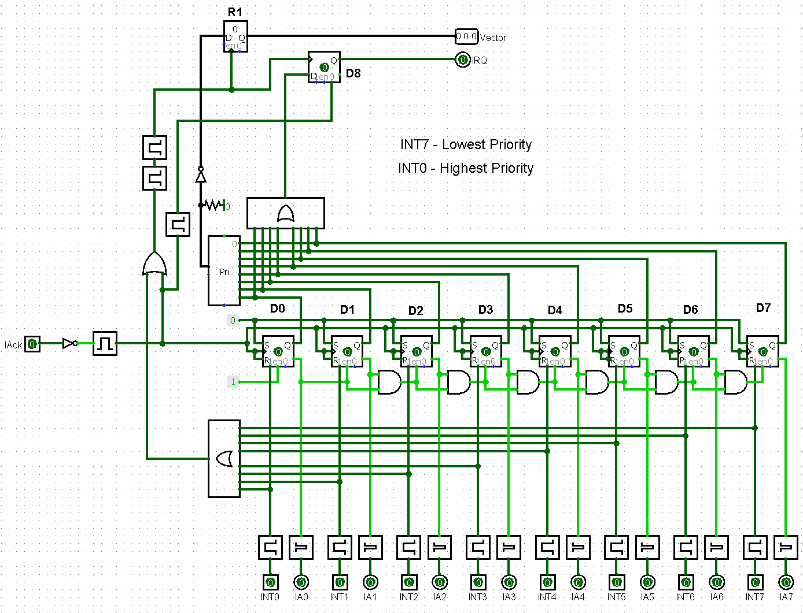
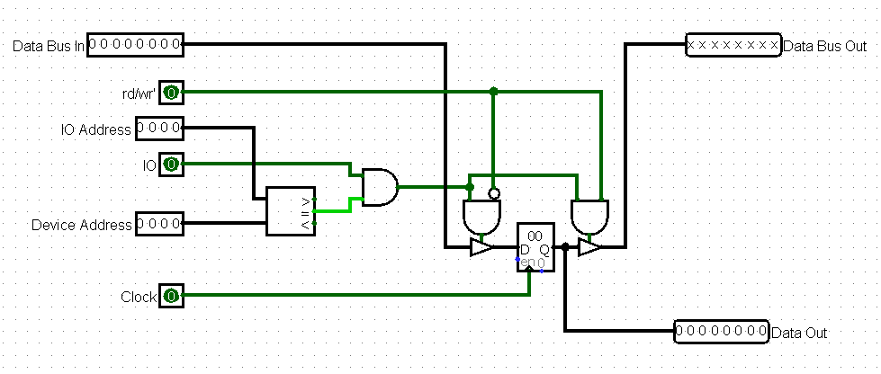
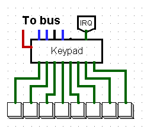

Universal Modular Platform based on Cdm-8 processor

Platform Description

# Overview
In our project we decided to build a universal platform that can be used for different purposes.

# Hardware 
In this section we will describe hardware part of this platorm.

## Basic setup
The bare minimum for this platform is Cdm8 CPU, Address Decoder, ROM and RAM


## IO Bus

To communicate with devices we need to define what IO bus looks like.



Bus lines:

* `Data` - processor data bus
* `IO Address` - lower 4 bits of processor address bus, generated by `Address decoder`
* `IO Select` - generated by `Address decoder`
* `Read/Write` - processor r/w' signal
* `Clock` - system clock signal

## Expanding ROM

If we need more program memory we can use ROM controller to get more address space with memmory paging technique. 

We take `Address Out` signal of `ROM Controller` and connect it as higher bits of ROM's address input.


You can read more about `ROM Controller` [here](#rom-controller)

## Expanding RAM

If we need more RAM we can use similar technique.The difference is that we divide RAM address space into two halfs - lower half is global and upper half is paged.

`RAM Controller` forms expanded address for RAM chip.

You can read more about it [here](#ram-controller)

## Handling Interrupts

#### Without ROM Controller

In Cdm8 in harvard setup interrupt vectors are located in in upper 16 bytes of program memory and therefore theese vectors are constant.

In out platform you can use it as is or connect [Dynamic Interrupt Controller](#dynamic-interrupt-controller) which allows you to change theese vectors by masking their addresses with external registers. 

But this device is unconpatable with ROM controller

#### With ROM Controller

[ROM Controller](#rom-controller) takes part in interrupt handling process - when interrupt occurs controller changes memory page to one that is specified on corresponding controller pins.

The easiest way to specify page to handle interrupts is to connect a constant to theese pins, however in this case you cannot change it.

Better solution is to connect a register to bus and it's output to ISR Page pins. In that case you can set page dyncamically in runtime.

## Devices description

In this block we will describe some devices more precisely.

### Peripheral Example

Most of devices connect to IO bus and therefore have similar block and signals that are used to communicate with the bus. 

+ `Select` - high when someone 'talks' to device, IO selected and IO address is the same as device address. 

> Of course, address decoding typically implemented through `AND` gates, but there we decided to replace it with `logisim`'s comparator to have an ability to conviniently set the address of devices. (perf)


+ `General bus signals` - pins for correspondig bus signals


+ `Device data bus` - pins that connect to data bus. Signals `Write` and `Read` are also generated here. They show whether we writing to this device or reading from it.


Typically, devices have general singals on their's north side and data bus pins on west side.


### Utility Devices

The some utility devices.


+ Front Detectors - two types of regular front detectors with shorter and longer pulse time.
+ 8-OR - Fancy 8 input OR gate.

### ROM Controller

This contoller is used to work with memory banks. It handles bank switching.  Moreover it takes part in interrupt handling, when interrupt occurs, controller switches bank to one that specified on `ISR Bank` input.

When jumping to bank, it saves current bank, it gives ability to jump to bank and then return from it just like regular `jsr` and `rts`. Moreover it supports recursive calls.


+ Programmer can switch between banks by writing a number N in range 0x00-0x7F. Then controller will switch to bank N.

+ By writing 0x80 or 0x81 we can reutrn from bank.

+ 0x80 is used to return from bank in general. 

+ 0x81 is used to ruturn from bank and restore registes.

+ If we read from it we get current bank.

To perform a jump you need to specify bank and address in this bank to jump to.

In this example we jump to bank 2 address 0x00:
```c
ldi r0, 0xF0 # Let controller be on address 0xF0
ldi r1, 0x02 # Jump to bank 2
st r0, r1    # Write command to controller
jsr 0x00     # Jump some address in target block
```

In this example we return from bank:
```c
ldi r0, 0xF0 # Let controller be on address 0xF0
ldi r1, 0x80 # "Return" command
st r0, r1    # Write command to controller
rts          # Return from function
```

In this example we return from ISR and restore registers:
```c
# Begining of ISR

pushall      # Save registers

# Some code...

ldi r0, 0xF0 # Let controller be on address 0xF0
ldi r1, 0x81 # "Return and restore" command
st r0, r1    # Write command to controller
popall       # Restore registers
rti          # Return from ISR
```

(It switches banks by forming high part of address.)


`S1` - memory chip that together with counter `C1` forms stack, so we can perform push and pop.

`R1` - intermediate register that stores byte (command) that was written.

The heart of this device is `Sequencer`. It is used to execute commands. `C2` is a counter that outputs current phase, its output is connected to decoder to convert binary number to separate signal representing phases. `D3` - trigger that enables counter. 

`Delay chain` is another important block of this device. It delays the pulse that starts `Sequencer` by certain amount of clock cycles. 

`D1` - trigger that indicates that device is handling interrupt.

`D2` - trigger that indicates that device is executing some commnd, its /Q output is connected to `IR Enable` output to disable interrupts while we performing a jump.

*How it works....*

**Executing a command (jump to bank, return):**

+ When processor writes a command: command is present in `R1`, `Write_Clock` is high, `rti`, `pop`, `push` signals are decoded.

+ `Write_Clock` sets `D2` high and so disables interrupts

+ `Write_Clock` starts a `Delay chain`, a pulse travels through `Delay chain` and then sets `D3` high and so enables `Sequencer`.

+ `Sequencer` execute some commands depending on 
task and then resets and disables itself and enables interrupts.

**Handling an interrupt:**

+ When processor starts handling an interrupt, `IAck` goes high.

+ `IAck` sets `D3` high enabling sequencer and sets `D1` high. 

+ `IR` switches `S1` data bus to `ISR Bank` input, setting target bank to bank with ISR's.

+ Then, regular 'jump to bank N' command is executed.

**Commands:**

*'jump to bank N':* 

Command will look like number in range `0x00`-`0x7F`, so general view is `0b0nnnnnnn`, where `nnnnnnn` is target bank number in binary

+ `rti` is low, `pop` is low, `push` is high
+ `inc` - increnent `C1` 
+ `store` - write `R1` to `S1` at address in `C1`
+ Then, `0b0nnnnnnn` is present on `Address Out` and theese are higher bits of ROM address

*'return from bank':*

Command is `0x80` or `0b10000000`. 

+ `rti` is low, `pop` is high, `push` is low
+ `dec` - decrement `C1`
+ Then, previous bank number is present on `Address Out`

*'return from bank and restore registers':*

Command is `0x81` or `0b10000001`.

+ The same as in regular 'return from bank', but `rti` is high.
+ `rti` switches multiplexer and sequencer start a couple of clock cycles later. That gives processor time to perform `popall` instuction.

All timings in clock-perfect amd were calculated for cdm8 mark 5.

*maybe timing diagram*

### RAM Controller

This controller is used to expand RAM.

The first 127 bytes in RAM address space are left as is. Second hals becomes paged. We can write to controller to change page, if we read from it we get current page.

+ When we address 0x00-0x7F, we address global part of RAM.

+ When we address 0x80-0xFF, we address one of pages.

> This doesn't include IO region. Of course, when we address IO region, we address devices.


The chip takes address bus as input and forms address especially for RAM chip.


Register here holds current page. Logic at the bottom forms address by taking 7 bits from address bus and adding page bits on top.

If 7-th bit of address bus is zero, that means that adress is in range 0x00-0x7F, then we ignore page bits, set upper bits to zero and output a 7-bit address with last bit being zero. This is the case when we address 0x00-0x7F (global part of RAM address space).

When we address paged part of RAM address space, 7-th bit is one, so register content incremented by one goes to upper bits of address.

### Interrupt Arbiter

This device handles 8 separate prioritized interrupts.


It connects to processor `IRQ`, `vec` and `IAck` pins.

On south size it has pairs of INTn and IAckn pins.

They are arranged like this (from left to right):

`INT0, IA0, INT1, IA1, ... , INT7, IA7`

Where INTn is request line for interrupt with vector n and IAn is corresponding IAck pin.

INT0 has the highest priority, INT7 - the lowest.



*expl*

### Interrupt Enable Buffer

This device is addon to `Interrupt Arbiter` that gives ability to disable cartain interrupts.

We can write a byte to it to set new state. If we read from it we get current interrupt state.

Bits in this byte enable or disable certain interrupts:

+ Bit 0 correspond to INT0
+ Bit 7 correspond to INT7

+ If bit is one - interrupt is enabled
+ if bit is zero - interrupt is disabled


It connects to `Interrupt Arbiter` from north and has IRQn and IAckn pin pairs on south side just like `Interrupt Arbiter`. 


Inside it is basically a register. Its bits are `AND`ed with corresponding IRQ pins.

Device has `Enable` pin that disables all interrupts. It is raised to 8 bits and `AND`ed to register bits.

`IAckn` signals just go through it.

### Address Decoder

This device forms signals that represent what memory region processor currently addressing.


Beside connecting to processor, you need to specify where would IO region be. If we connect it like on picture, we get IO to be on addresses 0x70-0x7F.

Output signals:

+ `Inst` - instruction region
+ `Data` - data region
+ `Vector` - interrupt vector region
+ `I/O` - IO region
+ `ROM` - ROM chip select
+ `RAM` - RAM chip select 
+ `IO Address` - IO deviecs address for IO bus


+ `ROM` is high, when either `Inst` is high or `Vector` is high - both instuction and vector are in ROM.

+ `IO Address` is lower 4 bits of address bus.

+ Other signals are formed in a obvious way.

| data/ins'   | Offset = IO Offset | Offset = 0xF | Decoder Output |
| :---------: | :----------------: | :----------: | :------------: |
|      0      |          0         |      0       |      Inst      |
|      0      |          0         |      1       |     Vector     |
|      0      |          1         |      0       |      Inst      |
|      0      |          1         |      1       |     Vector     |
|      1      |          0         |      0       |      Data      |
|      1      |          0         |      1       |      Data      |
|      1      |          1         |      0       |      I/O       |
|      1      |          1         |      1       |      I/O       |

### Dynamic Interrupt Controller 

This controller is used when you need dynamic interrupts vectors without using ROM controller.

However, this controller has very limited scope and that's why it won't be described here.


### IO Register 

This device is simple 8-bit register connected to I/O bus.

You can write to it and read from it.



### Hardware Stack

This device is a couple of registers arranged in stack configuration. Size of this stack is 20 bytes.

If you write to it, you push a value.
If you read from it, you pop a value.


Where each `Stack 4 byte` is:


### IO Hex Display Controller 

This device is used to drive two hex displays.
It is similer to regular `IO Register`, but has special interface for two hex displays. Contents of registed are displayed.


### IO Seven Segment Display Controller 

This device is similar to previous one, but it has special interface for 7-segment display.


### IO Random Number Generator

This device connects logisim's stock random number generator to IO Bus


We can read 8-bit random number. After reading a new number is generated.


### Display Controller

This controller is used to drive logisim's 32x32 pixel LED matrix *(mode 3 - "Select Rows/Columns")*.

It has monochrome and color versions.


We can write bytes to it and thus send data or commands. If we read from it, we get last command or data written.

**Available commands:** 

+ Write a pixel at (X, Y)
+ Write a block of pixels at (X, Y)
+ Clear screen and then write a pixel at (X, Y)
+ Clear screen and then write a block of pixels at (X, Y)
+ Clear screen

You can send either a data byte or a command byte.

**Data** byte looks like this: `0b0ddddddd`

+ Its most significat bit is zero, it indicates that it is data byte.

+ `ddddddd` - 7-bit data word (X, Y, Pattern/Mask).

**Command** byte looks like this: `0b1lwcxbgr`

+ Its most significat bit is one, it indicates that it is command byte.

+ `l` - bLock, if zero - print single pixel, if one - block of pixels.

+ `w` - write, if zero - don't print anything, if one - print something.

+ `c` - clear, if zero - don't clear screen, if one - clear screen before other actions.

+ `x` - not used

+ `b` - blue component

+ `g` - green component

+ `r` - red component

Color components are 1-bit so we get 3-bit color and thus we can have up to 8 colors *(black is also a color, it is coded `0b00000000`)*.

In monocrome mode only `r` component is used, it defines whether pixel is on or off.

**Command examples:**

+ `0b10010000` - clear screen

+ `0b10100001` - write red pixel

+ `0b11100010` - write block of green pixels

+ `0b10110100` - clear display and then write blue pixel

+ `0b11110001` - clear display and then write block of red pixels

**How to send commands:**

+ To perform **clear** command we just send one byte with command itself.

+ To perform **single pixel write** commands *(including ones with clear)* we need to send three bytes: first byte is `X`, second byte is `Y`, third byte is command itself.

+ To perform **block pixel write** commands *(including ones with clear)* we need to send four bytes: first byte is `mask`, second byte is `X`, third byte is `Y`, fourh byte is command itself.

> (0, 0) is in the lower left corner

**Code samples:**

In this example we print green pixel at (10, 15):
```c
ldi r0, 10          # X
ldi r1, 15          # Y
ldi r2, 0xF6        # Controller address
ldi r3, 0b10100010  # Print green pixel command

st r2, r0           # Write X
st r2, r1           # Write Y
st r2, r3           # Write Command
```


In this example we clear screen and then print block of red pixels at (6, 5):
```c
ldi r0, 6           # X
ldi r1, 5           # Y
ldi r2, 0xF6        # Controller address
ldi r3, 0x55        # Mask (0b01010101)

st r2, r3           # Write Mask
st r2, r0           # Write X
st r2, r1           # Write Y

ldi r3, 0b11110001  # Clear screen and print 
                      a block of green pixels

st r2, r3           # Write Command
```


In this example we simply clear screen:
```c
ldi r2, 0xF6        # Controller address
ldi r3, 0b10010000  # Clear screen command

st r2, r3           # Write command
```

Now we will focus on monochrome version. More about displaying color later.

This controller is designed to be used with LED matrix in mode 3 ("Select Rows/Columns"). In this mode matrix has two inputs on west side. Upper is column select and lower is data. You can read more about matrix behaviour in this mode in the [official documentation](http://www.cburch.com/logisim/docs/2.3.0/libs/io/dotmat.html)

So, controller has the same two ouputs which you connect to the matrix.

Controller generantes scan signal - pulses bits one by one on `Scan` pin and simultaneously outputs approrpiate data on `Data` pin. Repeatedly going through all 32 colomns, we get an image.

To be able to write to display without graphical artifacts (we can't read from memory and write to it simultaneously, if we want to write something to chip, it can't outupt data to maxtix, thus we get an artifact on screen), we use two buffers - acive, data from it goes to ouput, and shadow buffer - we write new data to it. Buffers store 32 32-bit words, each word correspond to one colomn. Buffers must store identical data.

When we update state of buffer:

+ Data is written to shadow buffer
+ Buffers are swapped, changes are now displayed
+ The same data is written to the second buffer to keep the same data in buffers.


`C1` is main counter, counts colomns to 32, connected to `col` signal.

In `Scanline Generator` we pass `col` through decoder and then wire its output to one 32-bit word to get scan signal. The delay chain here is needed to fix timings.

`M1` and `M2` are video buffers.

`D1` is trigger that chooses active buffer (other would be shadow buffer). It is wired in a flip-flop configuration, so on clock it switches its state and thus changes active buffer.

`Memory Multiplexing Logic` consists of different demultiplexors and multiplexors that wire `M1` and `M2` in a correct way (active buffer is wired to output, shadow buffer is wired to internal scheme).

`Append Logic` is used to get a 32-bit word from buffer, modify it, and then write it back to buffer. It just modifies bitword through `AND`ing or `OR`ing this bitword with some bitmasks. Depending on command, bitmask can be either one bit (to write single pixel) or 7-bit (to write block of pixels). Theese bitmasks are generated by this logic in obvious way.

`Data Queue` is four registers arranged in a queue. This queue is used to store commands and data. When we write a byte, it goes to the first register and all other registes are pushed forward. When we read, we get contents of the last register. Registers are wired to theese signals *(from left to right)*: `cmd`, `y`, `x`, `mask`. This defines data prococol that we described before.

`Command Decoder` is used to decode controls signals and color data from command byte.

Finally, `Sequencer` is used to sequently execute some internal commands *(clear, write to buffer, swap buffers)*. `D2` is its `Count Enable` trigger and `C2` is counter itself.

*How it works....*

+ When a byte is written, `write` signal pulses.

+ `write` resets `C2` and enables `D2`

+ If there is no command present (data byte was written) then `D2` is set low, sequencer doesn't do anything, scheme waits for next byte. Otherwise, `Sequencer` makes its cycle and then resets `D2` and thus stops itself.

*Then, there are four phases:*

+ On phase 0, we clear both `M1` and `M2` if `clear` command is decoded.
+ On phase 1, we write to shadow buffer, if `write` command is decoded.
+ On phase 2, we swap buffers.
+ On phase 3, we write to other buffer, if `write` command is decoded.

When we write to one of the memory chips, data from its output goes through `Append Logic` and them back to its input. By doing that we modify bitwords in memory chips.

**Displaying color:**

When using monocrome version of controller, we simply connect one matix to its outputs.

We can display different colors by stacking a bunch of martices on top of each other. The key thing here is to set their colors to red, green and blue, but with opacity not equal to 255 (in our case we picked opacity for each matrix to be 255/3). It that case we allow matrices to blend their color and thus get an ability to diplay multiple colors at once.

If fact, we can't directly stack matrices on top of each other, that's why we introduce some offset to it *(1 pixel)*.

Proper way of stacking martices is shown on picture below:


> Because of offset, active zone of screen loses 2 pixels, thus resolution of screen in color mode is 30x32 pixels, in monocrome mode it is 32x32 pixels.

### Joystick Controller

This controller drives 4-bit joystick.


Additional pins:

+ X,Y (west) - pins to X and Y outputs of joystick


It just connects 4-bit X and Y pins to data bus.

When reading from it you get actual position of joystick.

### Keypad Controller

This controller can drive up to 8 buttons. It can be used in polling mode or through interrupts.



Additional pins:

+ IRQ (north) - interrupt request line for this device, active when some buttons are pressed
+ Button pins (south) - 8 pins for buttons


It has 8 D-triggers each connected to a bit in a data bus. Buttons asynchronously set corresponding triggers. Triggers are reset on falling edge of `Read` signal (which is `rd/wr' AND Select`).

So, when reading from it, processor gets a byte that contains information about buttons that were pressed in the past (If some bit is 1, then corresponding button was pressed). After reading, all triggers are reset.

Moreover, if all triggers were zero and some button is pressed then a pulse occurs at IRQ output triggering interrupt.

### Terminal Controller

This controller is used to drive terminal and keyboard.


Additional pins:

+ Terminal/Keyboard pins (south) - pins that connect to terminal and keyboard


This controller basically just connects terminal and keyboard to bus in a way that when writing, 7 bits of data (as ASCII symbol) goes to the terminal and `last bit of data AND Write` forms `Terminal Clear` signal. That means that we can write a character to terminal as well as clear it by sending `0x80`.

When reading keyboard buffer connects to 7 bits of data bus and `Keybaord Available` goes to the last bit of data bus. That helps to read out a whole buffer. Just read from this device while data is not equal to `0x80`.

This device supports interrupts. If keybaord buffer was empty and then there was some input, a pulse occurs on IRQ.

# Software

In this part we will describe software part of this platform.

As we use more than 256 bytes of program memory and need to work with a lot of code. Default development tool (CocoIDE) is very unconfotable to use when working with multifile projects and that's why we developed some tools to make software development process easier.

## cocomake

The main application that does hard work is cocomake. It is an incremental build system desined to work with big multifile projects. 

It is incremental, so only modified files get recompiled. That makes compiling much faster.

You can define a toolchain - set programs which will be applied to file. 

Each file is compiled with thsi toolchain to an 256 byte image and then theese 256 byte images glued together to produce one big image that you load straight in logisim.


So, you can have one big project with a lot of files spannig to many modules and you just execute one command and get your project compiled in one image.

More about `cocomake` [here](https://github.com/Intelix8996/cocomake)

## VS Code Integration

For the text editor we decied to use VS Code as it is free modern software with a lot of customization options via extensions.

To make support for cdm8 assembler we develpoed an extension for VS Code that adds syntax highlighting for assembly and C preprocessor directives as well as code snippets.

# Demonstration

In this section we will describe our demonstation setup. 

## Project Overview

So, full project tree looks like this:


Let's take a look on cocomake configuration.

In `paths` file we define relative paths to working folders:

```
src=src
temp=temp
output=output
```

There we set source files folder to be `src/`, temporarty files foler to `temp/` and folder where final images would be to `output/`.

In `tools` file we define all the tools that we will use in our toolchain. Theese are assembler `cocas`, linker `cocol` and C preprocessor `mcpp`:

```
cocas=python cocas\cocas.py->obj
cocol=python cocol\cocol.py->img
mcpp=mcpp\mcpp.bat->asm->_p
debug=python cocoide\cocoideV1.91.pyw
```

The debug application is also defined here. It is set to `CocoIDE`, so when we run `cocomake -d [file]`, it will open this file in `CocoIDE` for debug.

Next, we define toolchains themself in `toolchains` file: 

```
asm=mcpp->cocas->cocol
obj=cocol
img=
```

There we configuring build system to pass `.asm` files through mcpp, cocas, cocol and then link to final image, pass `.obj` files through cocol and then link to final image and link `.img` files directly to image.

Then, we can create some `.cocomake` files that would describe final images, theese are located in `config` directory.

For example we have `firmware.cocomake`:

```
firmware.img
0:bootloader.asm
2:display_print.asm
5:app_example.asm
```

If we run `cocomake config/firmware.cocomake`, we will get `firmware.img` in `output` directory as result. 

Memory map of this image would look like this:

```
0000-00FF: bootloader.asm
0100-01FF: -
0200-02FF: display_print.asm
0300-03FF: -
0400-04FF: -
0500-05FF: app_example.asm
```

As you might have noticed, we use `mcpp` in our toolchain. That's because `cocas` doesn't have any `include` functionality. For multifile projects this feature is critical.

So, source files are located in `src` directory and header files are located in `include` directory.

For example, in `devices.h` file we define all devices' addresses and so we can use this header in other files.

```c
#include <devices.h>

// ...

ldi r0, IR_BUFFER_ADDR  // 
ldi r1, 0x00            // Init IR buffer
st r0, r1               //

// ...
```

There, `IR_BUFFER_ADDR` is from `devices.h`.

Another important application of headers is libraries. We can put some macros and rsects in header file to form a library. 

For example, we have `call.h` which defines macros to work with modules and ROM Controller.

```c
#include <call.h>

// ...

call 5, DEFAULT_ENTRY

//...
```

There, `call` is macro for calling other module defined in `call.h`, `DEFAULT_ENTRY` also defined in `call.h` and stands for module default entry point (0x00). 

Moreover headers can be used to export entry points for a module.
 
## Scheme Overview

Logisim schemes are located in `logisim` directory.

The main file is `cdm-platform.circ`. It contains only one scheme - one that we use for demonstration.

This file imports cdm8 scheme and `CdM8_mb5_library` which has all the devices.

So, in `cdm-platform.circ` we just connect CPU and all the devices with wires.

*scheme*

We use this this this

## Code Overview

So, our demonstration firmware consists of bootloader, sample program that prints "Hello cdm8!"???? and our main application - Battleship game.

**Battlesip**

To show the capabilities of our platform we decided to code Battleship game (soviet/russian varitant).

Rules are standart for this variant of game. In our version player plays agains AI.

Player has cursor on his screen which can be moves with buttons *(left, right, up, down)*. *Hit* button fires a shot.

...

*.cocomake*

*ai scheme*

However, game some limitations:

+ Maps for AI, and for player are hardcoded (16 maps) and randomly picked on start. 
+ If a player kills a part of the ship, he/she must contunie to kill exactly this ship (standart tactic).

In all other spheres?? it is fully functional battleship.

# Conclusion

idk


